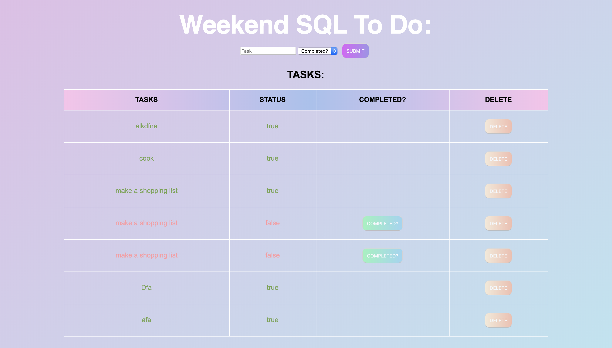

# SQL - TO - DO - LIST

## Description

This project creates a to-do-list that tasks in a new task and whether that task is completed or not. The new task will show up on the table. If the task is not completed, you can click on the button to change the status to completed. You also have the option to delete the task if you no longer want that task on your table. 

This project uses: javascript.js, jQuery.js, Express.js, Node.js, AJAX, and SQL. 

## Deployed
https://weekend-sql-to-do.herokuapp.com/